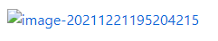
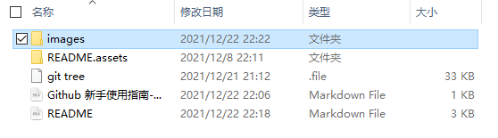
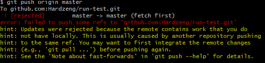
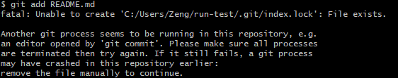

## GitHub 新手使用指南-常见问题

1. #### 图片不显示

   在上传文章至GitHub时，带有图片的文章会出现如下图片无法显示的情况：

   

   **解决办法**：

   - 新建一个`images`图片文件夹至本地仓库中

   

   - 在文章中插入图片时使用相对路径

     ```
     /images/pictures.png
     ```

   - 将`images`文件夹`Push`至GitHub仓库

     ```
     git init   #初始化文件夹
     
     git add images  #增加images文件夹，将内容写入暂存区
     
     git commit -m "add some pictures"  #提交暂存区到本地仓库
     
     git push origin master /git push origin master:master  #将本地master分支推送到origin主机的master分支
     ```

   - 然后将文章上传至GitHub中，图片就可以正常显示了。

2. ####  若服务器端修改文章内容，本地push文章会报错

   

   **原因：**由于在GitHub网站上编辑了README文件，本体与网站内容不一致

   **解决办法**：提交之前先更新本地内容

   ```
   git pull
   ```

3. #### **上传文件时出现以下报错**

   

   **原因：**Git操作时，修改文件导致操作冲突，文件被锁住

   **解决办法：**在该项目仓库中找到`.git`文件夹，将文件夹里面的`index.lock`文件删除即可。

   ```
   rm -f ./.git/index.lock  #将index.lock文件删除
   ```

   [相关参考](https://stackoverflow.com/questions/16602544/fatal-unable-to-create-git-index-lock-file-exists)

4.  #### 在刚进入git bash时上传文件可能会出现以下错误：

	```
    fatal: pathspec 'README.md' did not match any files
	```

- 原因：文件夹位置不正确，或者未初始化

- 解决办法

  - ```
    cd file #进入目标文件夹
    ```

  - ```
    git init # 初始化文件夹
    ```
  
  1. 上传文件不能不增加 `commit` ,严格按照这三步才能将文件上传上去。
  
     ```
     git add <filename> 
     git commit -m "代码提交信息"   ##备注修改内容，记录作用
     git push origin master   ##推送至master分支，可以修改为其他分支
     ```
  
  
